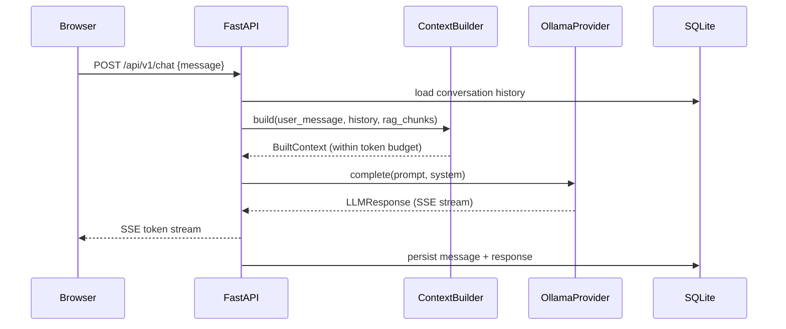

# JARVIS Architecture

## v0.1 Component Map

```
Browser (React + Vite)
        |
   HTTP / SSE
        |
   FastAPI (127.0.0.1:8000)
        |
   JARVIS Orchestrator  [Phase 1+]
        |
   ContextBuilder ──── token budget enforcement
        |
   LLMProvider (OllamaProvider)
        |
   Ollama (127.0.0.1:11434)

Supporting infrastructure:
  SQLite (WAL mode)  ──  conversations, memory, documents, settings
  Chroma             ──  vector embeddings  [Phase 2]
```

## Request Flow (Phase 1+)



## Security Boundaries

```
[Browser]  ──CORS allow-list──  [FastAPI 127.0.0.1]
                                        |
                              [PolicyEngine]  ← deterministic, not LLM
                                        |
                              [ToolExecutor]  ← only after policy approval
                                        |
                              [FileAccessRegistry / OS]
```

The LLM is a reasoning service. It proposes actions.
The PolicyEngine (deterministic code) decides whether they are allowed.

## Context Budget

```
max_context_tokens
  - max_response_tokens
  - safety_margin
  = effective_budget

Priority allocation (highest first — system never truncated):
  1. system/security instructions
  2. current user request
  3. required tool results
  4. retrieved RAG chunks
  5. relevant long-term memory
  6. recent conversation turns
  7. older summarised conversation
```

## Database / Vector Store Relationship

```
SQLite                          Chroma (Phase 2)
──────                          ────────────────
Document (id, hash, path)  ──►  chunk vectors
DocumentChunk (id, doc_id) ──►  (embedding_model_id, index_version)
Conversation / Message
Memory
ToolExecution
Settings / Workspace
```

The vector index is derived data. SQLite is the source of truth.
The index can always be rebuilt from SQLite + original documents.

## Health Dependencies

```
/health/live    ── process alive (always 200)
/health/ready   ── database + ollama healthy
/health/dependencies ── per-component breakdown:
    database        HEALTHY / UNHEALTHY
    ollama          HEALTHY / DEGRADED / UNHEALTHY
    data_directory  HEALTHY / UNHEALTHY
    vector_store    NOT_CONFIGURED (until Phase 2)
```
