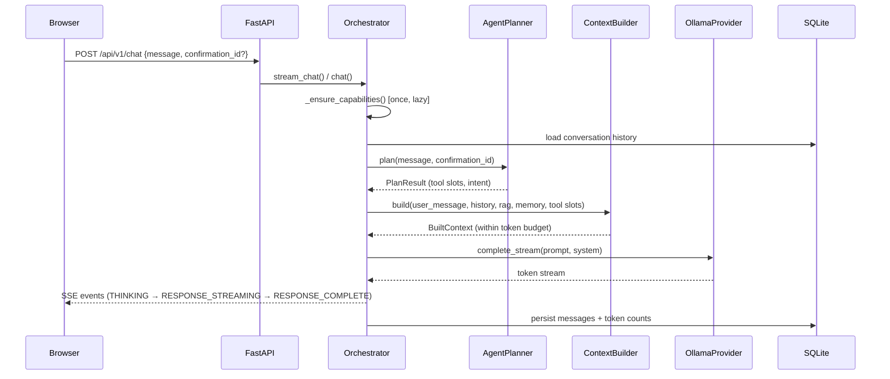

# JARVIS Architecture

**Current status: Phase 44 complete — 598 tests, 79% coverage.**

## Component Map

```
Browser (React + Vite)
        |
   HTTP / SSE
        |
   FastAPI (127.0.0.1:8000)
        |
   JARVIS Orchestrator
   ├── _ensure_capabilities()  ── lazy model context-window probe [Phase 44]
   ├── _prepare_turn()         ── shared chat/stream setup [Phase 43]
   ├── ContextBuilder          ── token budget enforcement
   ├── AgentPlanner            ── intent routing + tool execution
   ├── ConfirmationStore       ── SENSITIVE/DANGEROUS approval flow
   └── LLMProvider (OllamaProvider)
        |
   Ollama (127.0.0.1:11434)

Supporting infrastructure:
  SQLite (WAL mode)  ──  conversations, memory, documents, settings
  Chroma             ──  vector embeddings
  APScheduler        ──  automation job scheduler
  ToolRegistry       ──  registered tools (filesystem, system, k8s, web, calendar, memory)
  PolicyEngine       ──  deterministic tool authorization
  FileAccessRegistry ──  named filesystem roots (JARVIS_EXTRA_FILE_ROOTS)
```

## Request Flow



## Security Boundaries

```
[Browser]  ──CORS allow-list──  [FastAPI 127.0.0.1]
                                        |
                              [PolicyEngine]  ← deterministic, not LLM
                                        |
                              [ToolExecutor]  ← only after policy approval
                                        |
                              [FileAccessRegistry / OS]
```

The LLM is a reasoning service. It proposes actions.
The PolicyEngine (deterministic code) decides whether they are allowed.

## Context Budget

```
max_context_tokens  (from JARVIS_MAX_CONTEXT_TOKENS or model probe)
  - max_response_tokens
  - safety_margin (256)
  = effective_budget

Priority allocation (highest first — system never truncated):
  1. system/security instructions
  2. current user request
  3. required tool results
  4. retrieved RAG chunks
  5. relevant long-term memory
  6. recent conversation turns
  7. older summarised conversation

Model-aware adaptation (Phase 44):
  On first turn, Orchestrator probes llm.get_capabilities().
  If the model reports a larger context window than configured,
  ContextBuilder._max_context_tokens is updated automatically.
  Probe result is cached — never fires twice per session.
  Failure is silent — falls back to configured value.
```

## Tool Registration

All tools are registered at startup via `app/tools/registration.py`.
Feature-flagged tools are only registered when their flag is enabled:

| Tool group | Flag | Tools |
|---|---|---|
| Filesystem | always on | list_directory, read_file, search_files, file_metadata, open_file |
| System | always on | system_info, disk_usage, cpu_usage, memory_usage, process_list, open_application |
| Memory | always on | memory_search |
| Vision | `JARVIS_ENABLE_VISION` | vision_describe |
| Web search | `JARVIS_ENABLE_WEB_SEARCH` | web_search |
| Calendar | `JARVIS_ENABLE_CALENDAR` | list_calendar_events, get_todays_events |
| Kubernetes | `JARVIS_ENABLE_KUBERNETES` | k8s_list_contexts, k8s_list_namespaces, k8s_list_pods, k8s_get_pod_logs, k8s_list_deployments, k8s_cluster_health |

Extra filesystem roots: `JARVIS_EXTRA_FILE_ROOTS=C:/path1,D:/path2`
Extra allowed apps: `JARVIS_ALLOWED_APPS=obsidian,spotify`

## Database / Vector Store Relationship

```
SQLite                          Chroma (Phase 2)
──────                          ────────────────
Document (id, hash, path)  ──►  chunk vectors
DocumentChunk (id, doc_id) ──►  (embedding_model_id, index_version)
Conversation / Message
Memory
ToolExecution
Settings / Workspace
```

The vector index is derived data. SQLite is the source of truth.
The index can always be rebuilt from SQLite + original documents.

## Health Dependencies

```
/health/live    ── process alive (always 200)
/health/ready   ── database + ollama healthy
/health/dependencies ── per-component breakdown:
    database        HEALTHY / UNHEALTHY
    ollama          HEALTHY / DEGRADED / UNHEALTHY
    data_directory  HEALTHY / UNHEALTHY
    vector_store    NOT_CONFIGURED (until Phase 2)
```
